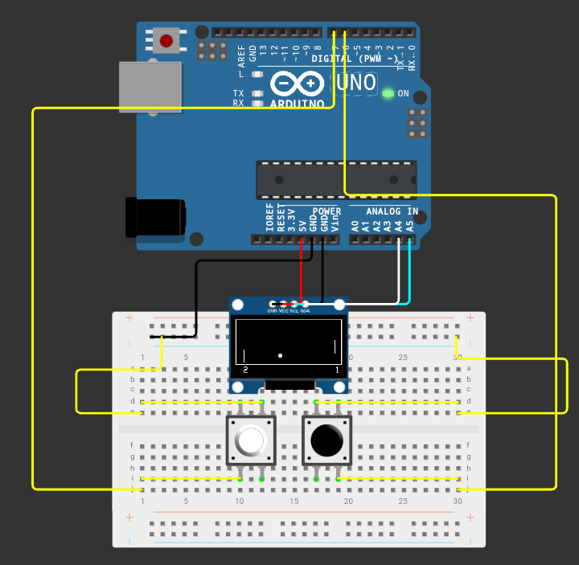

<h1 align="center">
	Game Ping Pong - Arduino
</h1>

	Um jogo feito em arduino, circuito simples e programação simples.

 <a href="#producao">Produção</a> • 
 <a href="#tecnologias">Tecnologias</a> •
 <a href="#autor">Autor</a>

### Produção

 Código totalmente criado por <a href="https://github.com/devalex16">Alex Silva - Gollinha</a> feito pra ser o mais simples possível de entender!

### Tecnologias

 Feito com Arduino UNO, Tela LCD SSD1306, dois botões e jumbers, integrado com <a href="https://learn.adafruit.com/adafruit-all-about-arduino-libraries-install-use/arduino-libraries">ADAFRUIT</a>.

### Tela do Game

Tela:128x64

## ✔️ Técnicas e Tecnologias utilizadas 
 - ``Arduino`` ``ADAFRUIT`` ``LCD SSD1306``

✔️ PROJETO FEITO ✔️

### Licença

Licença do Projeto [MIT License](./LICENSE)

### Autor
[
Gollinha - Alex Silva
](https://github.com/devalex16)

